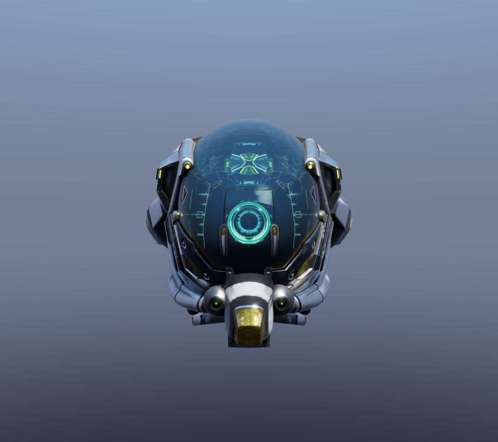
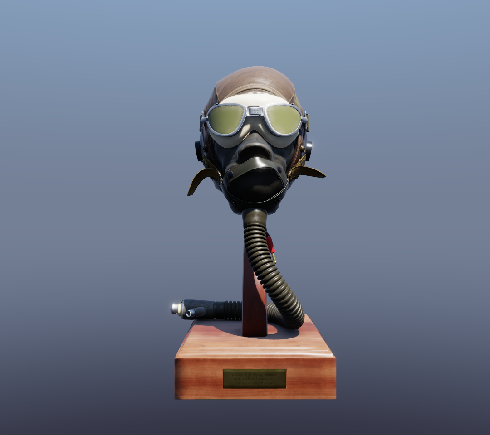
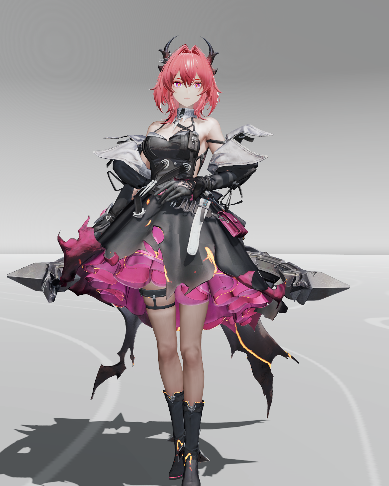

# deren

**deren** is a real-time renderer written in modern C++23 (C++20 modules / `.cppm`). Its graphics backend is being separated out behind an RHI - what is the backend versus what is the engine is still an open question (see the note below).

> **Renamed on 2026-10-02: this project is `deren`** (it was `vulkan_render`). The executable, the version macros, the reference-frame directory and the GitHub repository were renamed with it; the working directory was renamed last, from outside a session that held it open, and the old path no longer exists. Module namespaces still read `vulkan.*` and four doxygen groups still read `vulkan_render_*` on purpose: renaming those is a separate, still-open decision tied to the backend boundary. See `docs/mainpage.md` for the full note.

<p align="center">
  
  
</p>

<p align="center">
  
</p>

<sub>The two helmet shots are the default configuration as it stood when they were captured - deferred shading
with SSAO, the cascaded shadows, the IBL prefilter and the traced-GI path that has since been removed
(`1162d88`) - captured headlessly at 1080x960 from the scene's own framing, so they can be regenerated rather
than re-taken by hand. The character shot is the character-forward pipeline on a posed anime
model; that session had the `toon shading` combo at `off (plain pbr)`, so the shading response is the smooth
one and the banded cel looks are the combo's other values (see **Cel/toon shading** below). The debug overlay,
the title bar and the taskbar were cropped away. See [`snapshot/README.md`](snapshot/README.md) for both.</sub>

## Version

**0.3.0** — single source of truth is `project(VERSION)` in `CMakeLists.txt`; CMake injects
`DEREN_VERSION_{MAJOR,MINOR,PATCH}` into the code. To release a new version, bump it
there and update this line (plus `docs/mainpage.md`). The version is surfaced by `--version`,
the startup log banner (`deren x.y.z`), and the instance's `app_info`
(`applicationVersion` / `engineVersion`).

Each **independently reusable module set** also carries its own `module version` annotation
in a comment block at the top of its main interface unit — `deren.utility` 0.6.0a, `deren.vstd` 0.1.0a
(the trimmed `std` replacement), `deren.gltf_loader` 0.1.1, `deren.app_config` 0.26.0, `deren.vulkan.math` 0.1.1,
`deren.vulkan.constant_init` 0.9.0 (the compile-time info-struct builders that
`deren.vulkan.core` and `deren.vulkan.runtime` embed), `deren.vulkan.core` 0.21.0, `deren.vulkan.runtime` 0.52.0,
`deren.vulkan.profiling` 0.1.0, `deren.vulkan.pipelines` 0.12.0, `deren.vulkan.bindings` 0.5.0, `deren.vulkan.shadow_fit` 0.1.0,
`deren.vulkan.readback` 0.1.0, `deren.vulkan.acceleration_structure` 0.4.0,
`deren.vulkan.scene_tree` 0.2.0, `deren.vulkan.primitive` 0.8.0, `deren.vulkan.animation` 0.1.1a and
`deren.vulkan.graphical_user_interface` 0.4.0.
They evolve on their own cadence (bump MAJOR on breaking interface changes, MINOR on additive
features, PATCH on fixes), independent of the app version and of each other. An appended `a`
suffix marks an **internal revision**: source-compatible style, comment or import-graph changes
that do not consume a semver slot (e.g. `deren.gltf_loader` 0.1.0a after the switch from the vendored
`std` module to `deren.vstd`, or `deren.vulkan.animation` 0.1.1a after `deren.vulkan.primitive` was split out of
`deren.vulkan.scene_tree`).

## Features

> **Modular by design — free to combine.** Most modules here are independent,
> dependency-light units that talk to each other through narrow interfaces, so
> you can pick the pieces you need and assemble them however fits your project:
>
> - `deren.gltf_loader`, `deren.app_config` and `deren.utility` are **pure CPU with no Vulkan
>   dependency** — usable as standalone libraries in any host application;
> - `deren.vulkan.animation` is **format-neutral and runtime-agnostic**: it is driven
>   by an injected `backend` surface and a structural `source` concept, so it
>   neither imports a loader nor depends on `deren::vulkan::runtime` — swap in another
>   format or drive it from your own scene storage;
> - `deren.vulkan.core` / `deren.vulkan.runtime` expose a configured facade
>   (`create_info`, per-frame phase calls), and the top-level
>   `main.cpp` + `deren.chores` are just a thin glue layer — replace them with your own
>   entry point, or wire only the stages you want.
>
> In short: extend this renderer (add a pass, a primitive strategy, a loader) or
> embed its modules into your own project — the build is per-module CMake
> targets, so you link only what you use.
>
> **The frontier of the API is a feature here, not the foundation.** Descriptor
> heaps instead of descriptor sets, dynamic rendering, timeline semaphores, ray
> queries, mesh shaders and host image copies are in because each one buys
> something measurable; the modules below the backend are deliberately not API
> modules, and the backend boundary itself is still being drawn.

- **Vulkan wrapper (`deren.vulkan.*` modules)**: C++ modules wrapping the full initialization flow. `deren::vulkan::runtime` is created from a `create_info` (window, vsync, validation, or a caller-provided `GLFWwindow`) and drives each frame through granular phases - `poll_events()` → `pace_and_acquire()` → `begin_recording()` → `record_main_drawcalls()` → `end_recording()` → `submit_and_present()` - each returning a `frame_status`, with `render_frame()` running them all for callers that have no interleaved per-frame updates; the runtime owns the scene-wide GPU resources. Frame pacing uses timeline semaphores (one per frame slot, no fences) while acquire/present signals stay binary, and pass recording is multi-threaded into per-slot secondary command buffers.
- **Scene tree / GPU primitives (`deren.vulkan.scene_tree` + `deren.vulkan.primitive`)**: a pure-CPU tree of nodes (deren.vulkan.scene_tree), walked once per frame to accumulate world matrices; GPU drawables live in the peer `deren.vulkan.primitive`: every one is a `primitive` subclass with a polymorphic `draw()`. `scene_node` / `scene` expose mounting helpers (`add_root()` / `add_child()` / `attach()` / `find_node()`). **Pipeline binding is decoupled from the scene tree**: a leaf carries either *default semantics* (empty `pipeline_name`) or an explicit pipeline name, and `draw(render_environment&)` requests the pipeline through the `deren.vulkan.render_environment` (`bind_default()` / `bind_pipeline(name)`); default leaves are pipeline-agnostic, so the same geometry renders under any default. The tree is **caller-owned** (`runtime::set_scene()`), and must be destroyed before the runtime, so its leaves' GPU buffers (`vk_buffer`/`vk_image` RAII owners from `deren.vulkan.core:vma_handles`) release through the still-alive allocator.
- **Multi-pipeline scenes (`deren.vulkan.render_environment`)**: pipelines are named and cached in the runtime (`make_pipeline(name, vs, frag)`); the **first created pipeline becomes the implicit default**, `set_default_pipeline(name)` overrides. Every pipeline shares the single flat scene descriptor layout, so any number can coexist in one scene — leaves choose per draw. Each parallel recording worker builds its own `render_environment` (thread-local bind state, never shared), which describes the session's available pipelines and hands `draw()` a deduplicated binder: default leaves request the session default, custom strategies request a name. The shadow pass binds its depth-only pipeline through the same mechanism (its environment ignores the requested name), so custom leaves still cast their geometry into the shadow map.
- **BVH frustum culling**: per-frame, a BVH is built over every leaf's world AABB and tested against the camera frustum; the tree is rebuilt only when the scene changed and the culled result is reused while the camera is static. Toggle with `set_frustum_culling()`.
- **Dynamic rendering**: the engine requires Vulkan 1.3 (device selection enforces `apiVersion >= 1.3`), so every frame records through `vkCmdBeginRendering` — no render pass / framebuffer objects exist. The shadow pass is depth-only dynamic rendering.
- **Static/merged batching (`static_draw_primitive`)**: one primitive OWNS a merged vertex/index buffer and draws a chunk table over it — one buffer bind, then one offset draw per chunk with each chunk's own material. N static sub-meshes cost 1 bind + N draws instead of N binds + N draws; the same buffer can carry many different materials. Built via `runtime::make_static_draw(static_draw_create_info)` from already-merged CPU geometry (the packing itself stays at the call site).
- **Descriptor heap, not descriptor sets**: every stage's resources come from ONE resource heap and ONE sampler heap the frame binds once (`descriptor_heap::record_bind`) and every pipeline is heap-native — `VkPipelineCreateFlags2CreateInfo` carrying `VK_PIPELINE_CREATE_2_DESCRIPTOR_HEAP_BIT_EXT` with `layout = VK_NULL_HANDLE`, so no set layout, pool, descriptor set or pipeline layout exists. The heap is a flat grid of 64-byte slots at a 1 MiB base (`core::heap_slots`, mirrored by `shaders/heap_slots.glsl`): the bindless texture array, the GPU material table, the per-frame-slot camera / light / cluster / instance / skin / morph arrays, the IBL cubes and BRDF LUT, the shadow map and the G-buffer / post / ray-traced-visibility / MegaLights images, the TLAS, the storage-descriptor twins, and the scene's own per-slot block. Which frame slot or swapchain image a stage reads travels in its own push block (`vkCmdPushDataEXT`, the `heap_frame_slot` / `heap_image_index` lanes), so ONE pipeline serves both frames in flight.
- **GPU material table**: each material is one `material_record` in the storage buffer (5 texture-array indices + factors + flags). A primitive references a material by index, the shader reads `materials[push.material_index]` and samples `textures[<index>]` — material data is stored once on the GPU and shareable between primitives.
- **GUI priority over the camera**: while the cursor is over the debug overlay (or a widget is being dragged / the wheel scrolls inside a panel) the GLFW mouse callbacks are suppressed, so tuning a slider never rotates or zooms the view; the cursor position is still tracked so leaving a panel does not jump the camera.
- **Camera keyboard panning**: the **arrow keys** move the camera - LEFT/RIGHT strafe along the camera's right vector, UP/DOWN rise and fall along **world up** (not the view direction, which would read as a zoom), **SHIFT** for 4x. The pan translates the orbit *target*, so the rig slides without the view rotating: yaw / pitch / distance are untouched. The speed is tied to the orbit distance (0.75 x distance per second, 0.1-unit floor), the step is `speed x elapsed time` off `glfwGetTime` (frame-rate independent, `dt` clamped to 0.25 s), both axes are normalized together, and a frame with **no arrow held leaves the camera untouched**. The arithmetic is the exported pure function `deren::vulkan::orbit_camera_pan_delta` (`vulkan/primitive`), checked headlessly in `test_math`. There is no gui guard, because the debug overlay has no keyboard-capturing widget (`gui_content` exposes `wants_mouse` only).
- **Screenshots**: press **F12** - the runtime records a copy of the frame's swapchain image into a persistent host-visible read-back buffer **inside the frame's own command buffer** (right after the post pass, before the present transition), then `runtime::acquire_current_frame_image()` waits for the GPU and hands back the pixels (8-bit RGBA), which the demo writes as `screenshot_<timestamp>.png` via `deren::utility::write_png()` (a dependency-free PNG encoder). The base directory comes from `[paths] screenshot_dir` (empty = current working directory, created on demand). The swapchain is created with `VK_IMAGE_USAGE_TRANSFER_SRC_BIT` (added only when `supportedUsageFlags` allows it); on a surface that cannot do that, the runtime logs it once and F12 stays disabled instead of issuing an illegal copy. One F12 (or one `request_screenshot()`) is **one** attempt: the captured flag is consumed by `consume_screenshot_request()` whether or not the read-back succeeded.
- **Exposure**: a linear exposure scale applied before the ACES tonemapper in the lighting stage (gui "exposure" slider -> `runtime::set_exposure`).
- **Binary output (`deren::utility::write_binary`)**: a small append-only writer that every binary format in the project goes through - PNG today, anything else later. `write_binary(sink, args...)` folds its arguments into any sink (`std::ostream`, an `std::ofstream`, or a five-line test sink), `write_binary_file(path, args...)` opens one for you in binary mode, and `write_single` accepts a closed set of shapes: a scalar tagged with `be()`/`le()` (byte order is explicit), a contiguous one-byte range (`std::span` / `std::array` / `std::vector` / `std::string_view`) written as exactly `size()` bytes with no length prefix, a contiguous range of trivially copyable values as one block write, and a plain struct as its native representation. Unsupported types (raw pointers, enums, a range of non-trivial elements) are rejected by the `binary_writable` concept at compile time, and the first failed write aborts the fold with an error. `deren::utility::write_png` is built on it: the frame streams straight to the file through a CRC-ing sink.
- **Cel/toon shading**: the `toon shading` combo (off / 2 / 3 / 4 / 5 / 6 / 8 bands) plus the `toon softness` slider quantize the direct-light diffuse falloff into bands, harden the shadow edge and turn the specular lobe into a hard highlight block. Fewer bands = harder cel look (more bands converge back to smooth PBR), and a small softness keeps the band edges crisp; only the shading response is banded - geometry, silhouettes and the IBL ambient stay smooth.
- **Post-processing**: the G-buffer pass writes its 1x surface targets and the lighting stage shades them into an **HDR offscreen target** (RGBA16F); a fullscreen post pass applies the linear **exposure** scale and ACES tonemapping. The composite outputs a **linear** tonemapped image: the swapchain is an sRGB attachment (`B8G8R8A8_SRGB`), so the hardware encodes to display values on write. Encoding gamma in the shader as well is a double encode (a linear 0.5 stored as 188 instead of 128), so the shader's manual sRGB transfer function only runs for a non-sRGB format (`post_push_constants::encode_gamma`). All display-referred processing lives in `shaders/post.slang`, which also runs the **bloom** chain: a four-level prefilter / downsample / composite back into the HDR image (gui "bloom intensity" (0..3) / "bloom threshold" (0..0.75); defaults 0.35 and 0.8). The bloom stages render into `R16F` levels while the composite renders the swapchain, so `make_post_pipeline` builds **two** pipelines from the one shader pair, one per color format.
- **PBR rendering**: standard metallic-roughness workflow with five texture slots (albedo (sRGB), metallic-roughness, normal, occlusion, emissive) and glTF alpha modes (`OPAQUE`, `MASK` discard at `alphaCutoff`, `BLEND` in a separate back-to-front pass). The BRDF theory model is switchable live from the debug GUI ("brdf model" / "diffuse model") - GGX + Smith by default, plus Beckmann, Blinn-Phong, Lambert and Oren-Nayar variants - but the presets drive the direct lights only, the IBL ambient always using the fixed GGX model. Punctual lights are configured via `runtime::set_point_lights(std::span<deren::vulkan::punctual_light>)` (up to `deren::vulkan::max_punctual_lights` = 128).
- **IBL lighting**: CPU-precomputed environment cubemap → GGX importance-sampled prefiltered environment (mip chain), irradiance map, and BRDF LUT (split-sum), uploaded as `R16G16B16A16_SFLOAT` cubemaps / `R16G16_SFLOAT` LUT. Precompute resolutions are configurable.
- **Directional shadows / cascaded shadow maps**: an orthographic shadow pass renders the scene's depth from the sun into a 2048² **2D-array** depth image (`[render] shadow_cascades` = 1..4, 3 by default). The fitted view range is split by the practical split scheme (Zhang et al., lambda 0.75) into per-cascade light-space boxes. The fragment shader picks its cascade from the **view-space depth** and blends over `shadow_cascade_blend`. Each cascade is recorded into its own per-slot **secondary** command buffer over a lazily created layered image. The ortho box **follows the camera every frame**, center-snapped to the texel grid with the size rounded to whole texels, with **normal-offset bias + 3x3 PCF** through a LINEAR `sampler2DArrayShadow`; every caster is rasterized **two-sided**, and masked (`alphaMode MASK`) casters are alpha-tested **inside the depth pass**. Depth bias is dynamic state, tunable live from the debug GUI. Shadow casters are selected per scene size: scenes up to 1500 leaves render every leaf, heavier scenes only the camera-visible leaves plus those the BVH reports inside a cascade's shadow frustum.
- **Clustered light culling**: the punctual lights are sorted into a screen-tile x exponential-depth-slice grid by a COMPUTE pass (`shaders/light_cluster.slang`). The grid is 64 px tiles x 16 depth slices, each cluster holding a fixed-capacity list of up to 32 light indices - one atomic counter per cluster, no prefix sum or linked list, so the fragment stage reads `count` and indexes that many. Both the compute dispatch and the shading loop use the same `cluster_slice_of()` slice boundaries. The light UBO carries **128** lights now (up from 4, still inside the 16 KB `maxUniformBufferRange` guarantee) and `[lighting] demo_lights` spawns a helix of them for stress. Verified: with 64 lights at 960x720 the shading pass drops from 1.28 ms to 0.44 ms, the clustered and brute-force images are **byte-identical**, and `[render] clustered_lights = false` is the brute-force reference. Lights are culled by bounding sphere (`range`, 0 = no cutoff), spot cones conservatively as spheres.
- **Anti-aliasing (FXAA)**: an optional final fullscreen pass (`shaders/fxaa.slang`, Lottes' FXAA 3.11 quality variant) over the **tonemapped, gamma-encoded** image - display-referred data is what its relative luma thresholds are defined on. It needs its own input, so with FXAA on the composite renders into a per-swapchain-image display-referred target (`core::ldr_images`, R16F holding gamma-encoded values) and FXAA writes the swapchain; with FXAA off the composite writes the swapchain directly. The debug overlay is drawn **after** FXAA. Knobs: `runtime::set_fxaa(enabled, subpixel, edge_threshold)` / `[render] fxaa` + two overlay sliders - the sub-pixel term (0 = pure directional blend) and the relative edge threshold (0.166 is the FXAA default). It is a screen-space edge blur, so it fixes geometry jaggies cheaply but cannot remove sub-pixel shimmer in motion (that needs TAA) and does soften fine detail.
- **GPU pass timings (profiling)**: `[render] gpu_timings` (on by default) writes a `vkCmdWriteTimestamp` at each pass boundary (frame start / shadow / main / bloom / composite / FXAA / frame end) into the slot's own query range and reads it back without waiting on the GPU; a pass that did not record still writes its mark, so the label-to-interval mapping never shifts. The same 60-frame window reports the CPU frame phases, which is what explains a frame above a few hundred fps: measured on the RTX 4060 at 960x720, the PBR frame spends 1.32 ms of CPU in the main recording phase against 0.52 ms of GPU in the whole frame, and the shadow pass alone is 1.00 ms of that 1.32 ms of serial command recording.
- **G-buffer / deferred path**: the opaque pass stores the surface instead of shading it - the engine's only scene path - writing three single-sampled targets plus the HDR target the emissive term is added into, and `shaders/deferred.slang` reshades every pixel from those targets in screen space. `shaders/surface.glsl` owns the material-surface gather and `shaders/shading.glsl` the lighting, so the same functions serve both paths, and the deferred stage writes additively over `shaders/sky.glsl`'s analytic sky. `runtime::set_gbuffer_debug(true)` / `[render] gbuffer_debug` draws the same G-buffer as a channel view instead (albedo / normal / roughness / metallic / AO / material id / depth / flags / motion), because a G-buffer's contents cannot be judged from a shaded screenshot.
- **Screen-space ambient occlusion**: the deferred lighting stage traces a golden-angle hemisphere of samples around each pixel against the G-buffer depth (plus the world normal from RT1) and folds the result into the `shade_input` ao, so it scales the IBL ambient exactly like a material's baked AO map - no extra pass, no extra render target. The kernel rotates per pixel (a hash of `gl_FragCoord`), and the range check fades each contact out over the radius. Knobs: `[render] ssao` / `ssao_radius` / `ssao_intensity` / `ssao_samples` (1..16 samples) plus an overlay checkbox and three sliders. Measured at 960x720 on Sponza: mean absolute luminance 0.77/255 over 1.4% of pixels at a 2.0-unit radius, and with SSAO off the frame is BYTE-IDENTICAL to the pre-M6 reference. Honest limits, both inherent: it scales the ambient only (the direct sun is never occluded), and the radius is in world units, so a distant view shows less contact darkening than a close one. It is the classic hemisphere-sampling SSAO, not a horizon-based GTAO.

- **Ray-traced sun shadows and the acceleration structures**: `[render] rt_shadows` traces one ray per pixel against a TLAS built from the shadow-caster set, so a shadow answers visibility for the exact point rather than for a texel of a cascade; off by default and granted only on a device with `VK_KHR_ray_query`, so the cascaded maps keep running elsewhere. It runs on a ray-tracing PIPELINE whose any-hit shader refuses `MASK` hits below the material's alpha cutoff, measured on the AlphaBlendModeTest asset at 3.0/255 of mean absolute difference from the raster shadow against 136.6/255 without it.
- **A verification mode, not a look (`[render] furnace`)**: the sun is turned off and the environment becomes a constant level, which makes the correct frame computable by hand - a diffuse surface's outgoing radiance is then exactly `albedo * L`. It is the one reference here that no estimator of its own can flatter, and its premise is narrower than it looks: the identity needs the incident radiance to be `L` from EVERY direction, which is true of a convex object and false inside a building, so its acceptance is an exactness test on a scene whose premise holds.

- **Render feature registry + pass gating**: `runtime::render_features` / `active_features()` is the single derivation of what actually runs this frame - config + GUI state, the pipelines that exist, and the real gates. `runtime::feature_active(name)` answers the same question by name, and BOTH the pass recording and the debug overlay read it: the overlay offers a control only when switching it could change the frame. The first gates: the shadow pass does not record in the flat (unlit) render mode, and the cluster dispatch is skipped then too, and also when no punctual light is active. Measured at 960x720 on Sponza, 150 frames: unlit 0.40 -> 0.19 ms while the PBR frames are unchanged and all four images are BYTE-IDENTICAL to the pre-gating captures. The fps counter cannot see sub-millisecond wins, so feature cost is read from the per-pass GPU timings instead.

- **Static shadow-map reuse**: the shadow pass fills a frame slot's cascade maps only when they would change and otherwise skips recording entirely. Two signals: a versioned counter on the fitted cascade matrices, and an XXH3-64 fingerprint of the caster geometry (`runtime::shadow_geometry_signature()`). The geometry half is what makes the skip safe - a skinned mesh keeps a constant `push.model`, so hashing world matrices alone left the animated Fox with a frozen shadow map. Measured at 960x720 on Sponza with 3 cascades: the CPU `shadow*` phase drops 0.61 -> 0.00 ms and the visible-window probe goes 822 -> 2278 fps.
- **Debug GUI (`deren.vulkan.graphical_user_interface`)**: a Dear ImGui overlay driven inside the runtime's frame steps (**F1** shows/hides it, and initializes it on demand when `[gui] show` started false); widget subclasses stack into `debug_panel`s registered via `runtime::debug_gui()`, and a control is offered only when the session can use it (`visible_when`). The demo panel shows fps and the per-pass GPU timing line and drives the frame's switches - frustum culling, the shadow pass, FXAA, clustered light culling, SSAO, the G-buffer debug channel, the pbr/unlit render mode via `runtime::set_unlit`, TAA, the shadow bias and cascade count, and the four editable punctual-light slots.
- **glTF loading (`deren.gltf_loader` module)**: standalone CPU module built on [fastgltf](https://github.com/spnda/fastgltf), supporting `.gltf` / `.glb` / data URIs and exporting both a flattened drawable stream and the retained node hierarchy (name + local transform + children, plus per-node TRS base pose, asset-node index, skin and morph references) with raw de-interleaved vertex/index data (JOINTS_0 / WEIGHTS_0 and morph-target deltas included) — and the file's keyframe animations (channels/samplers incl. morph `weights`, times + values decoded to floats, with pure-CPU LINEAR/STEP/CUBICSPLINE sampling), skins (joints + inverse bind matrices) and morph targets (POSITION/NORMAL deltas + default weights). Meshes without a `NORMAL` attribute get per-vertex normals **generated from the triangle connectivity** (smooth, area-weighted).
- **Keyframe animation + skinning + morph targets (`deren.vulkan.animation`)**: `deren::vulkan::animation::controller` plays channel-bearing animations automatically on a loop — it samples animations into the scene tree's node locals, rebuilds the per-frame skin matrices (`inv(W_mesh) · W_joint · IBM`) and updates the active morph weights into the runtime's per-frame-slot buffers. It is **format-neutral**: animation data is value-copied into its own `deren::vulkan::animation` structures at init, and `init()` is a template over the `source` concept, so any loader exposing the required member shapes can drive it. Heavy animations fan the per-source sampling out over a small `deren.utility:thread_pool`, up to 840 channels over 924 nodes in the stress sample. The `gui` overlay adds play/pause, a time scrubber and an animation dropdown.
- **Orbit camera**: left-drag to rotate, wheel to zoom; one shared camera UBO is updated once per frame, with `MAX_FRAMES_IN_FLIGHT` frames in flight.
- **Utility library (`deren.utility` module)**: handle distribution, stack-style destructor mixin, thread pool (`deren.utility:thread_pool`: RAII pool of `jthread` workers with priority queue + `wait_until_free()`, used by the animation sampling fan-out), BVH (used by frustum culling), data block, a per-frame stamped clock (`deren.utility:frame_clock`: single-writer stamps, atomic-load readers), and more. A mimalloc-backed `pmr` manager (`deren::utility::init_pmr()` via `better_pmr`) routes all `std::pmr` allocations — including the runtime's per-frame cull/visible vectors — through mimalloc (vendored under `third_party/mimalloc`); it is idempotent and initialized before `main` from every TU that uses it. Content hashing for GPU-resource dedup is [xxHash](https://github.com/Cyan4973/xxHash) `XXH3_128bits` (`deren::utility::xxh3_128bits`, vendored under `third_party/xxhash`); the narrower `deren::utility::xxh3_64bits` fingerprints the per-frame shadow-reuse signature.
- **Startup configuration (`deren.app_config` module)**: TOML config (`config.toml`, `--config <path>` override) merged with argv, covering model / instancing grid, resource paths, window/render settings (size, title, vsync, clear color, initial camera framing, shadow/fxaa/gpu-timings toggles, the cascade count + blend band of the shadow pass, the G-buffer debug view and its channel) and IBL resolutions. See `config.example.toml`.
- **Engineering practices**: automatic `clang-format` before every build, `-Wall -Wextra -Werror`, and **exceptions disabled in all build configurations** (`-fno-exceptions`; the vendored `std` module makes this work), plus `-flto -march=native -fno-rtti` in Release builds (LTO also covers the vendored libs). Release additionally runs dead-code elimination (`-ffunction-sections -fdata-sections` on every target + link-time `--gc-sections`) and strips symbols at link (`-s`), keeping the single-file exe at ~2.9 MB with no runtime cost.

## Documentation

The project uses **Doxygen** for API documentation; every module, class, interface **and shader** is annotated in-source with `@defgroup` / `@brief`. The shader sources are part of the generated reference too: `Doxyfile` maps `*.slang` (and the retired `*.vert` / `*.frag` / `*.comp` extensions, plus the `*.glsl` includes) to the C++ parser (`EXTENSION_MAPPING` + `FILE_PATTERNS`), so each shader gets a file page with its documented functions, all collected under the `shaders` group (see [docs/shaders.md](docs/shaders.md) for the pass chain, the shared scene-set binding table and the push-constant contract, and [docs/conventions.md](docs/conventions.md) for the module-name, verb-prefix and partition rules). The generated HTML and the LaTeX manual are **not** committed to the repo (they would drown the source tree in generated files) — build them whenever you need them with the platform wrapper script: `scripts/windows/build_docs.ps1` (PowerShell / Windows) or `scripts/posix/build_docs.sh` (POSIX sh — WSL / Linux / macOS / an MSYS2 shell). They run `doxygen Doxyfile`, then compile the LaTeX manual into `docs/latex/refman.pdf`:

```bash
# Windows (PowerShell)
powershell -ExecutionPolicy Bypass -File scripts/windows/build_docs.ps1

# POSIX (Linux / WSL / macOS)
sh scripts/posix/build_docs.sh
```

Raw equivalent: `doxygen Doxyfile` (HTML only). `Doxyfile` names the project `deren` (kept in step with `project()` in `CMakeLists.txt`), uses `docs/mainpage.md` as the manual's front page, and lists the `docs/*.md` pages one at a time rather than pointing at the whole directory - `docs/` also holds doxygen's own output and the two reference sets that are not this project's prose, so a new page has to be added to its `INPUT`, and the order of those lines is the manual's chapter order.

Output: `docs/html/` (open `docs/html/index.html`) and `docs/latex/` + `docs/latex/refman.pdf` (all gitignored). The LaTeX step needs a TeX distribution (`pdflatex`/`makeindex`; `make`, `latexmk`, or bare `pdflatex` all work — MiKTeX's per-user install under `%LOCALAPPDATA%` is found automatically). The non-ASCII characters the sources are allowed to keep are what the new `docs/latex_unicode.sty` is for: `Doxyfile` sets `LATEX_EXTRA_STYLESHEET` to it, and pdflatex stops on the first such character without it.

Related source docs (tracked in the repo):

- [gltf_loader usage guide](docs/gltf_loader_usage.md) (API semantics, data formats, Vulkan integration examples)
- [shader reference](docs/shaders.md) (the pass chain, the shared scene set, push constants, conventions) — also the Doxygen `shaders` group description
- [MegaLights reference study](docs/reference/megalights_stochastic_lighting.md) (what UE 5.8.2 does, as a mechanism reference)
- [MegaLights: stochastic punctual lighting](docs/megalights.md) (the feature, its acceptance numbers and what it cost)
- [mesh shaders](docs/mesh_shaders.md) (what the stage buys here, this device's limits, the heap-native mesh probe, the shadow pass's mesh stage, and the migration plan)
- [capture harness](scripts/windows/check_render.ps1) and the [measurement instruments](scripts/measure/README.md) every number in the docs came out of
- [docs/official-shaders/](docs/official-shaders/): reference shaders (IBL / PBR / primitive)

## Layout

```
├── main.cpp                 # Demo entry point: start async loads -> runtime init -> scene import
│                            #   -> animation/camera/gui setup -> granular frame-phase render loop
├── chores.cppm / chores.cpp # chores module (root-level demo bootstrap): analyse_config (config +
│                            #   argv merge, shaders/model location), setup_pipeline,
│                            #   add_instancing_grid, shader loading
├── CMakeLists.txt           # CMake 4.3, C++23 modules build
├── config.example.toml      # Annotated startup-config reference (copy to config.toml)
├── Doxyfile                 # Doxygen config (PROJECT_NAME: "deren")
├── application_configuration/  # app_config module (TOML startup config + argv merge)
├── vulkan/                  # vulkan modules (core / vma / handles / init_utils / pipeline / spirv_parser / math /
│                            #   runtime / bindings / pipelines / profiling / shadow_fit / readback /
│                            #   scene_tree / render_environment / graphical_user_interface / animation)
├── utility/                 # utility module (data_block / better_pmr / BVH / thread_pool / frame_clock)
├── gltf_loader/             # gltf_loader module (CPU-side glTF/GLB loading)
├── vstd/                     # vstd module — modified from libc++ (LLVM), trimmed to the project's
│                            #   STL usage (import deren.vstd; see vstd/README.md)
├── shaders/                 # Slang sources (the build compiles them to SPIR-V with slangc; the binaries are
│                            #   not tracked); glsl.old/ holds the retired GLSL stage sources, and the shared
│                            #   bodies the leaves include (surface/shading/sky/ibl_specular/heap_slots) stay
│                            #   here - documented in-source and grouped under the Doxygen "shaders" group
├── gltf_model/              # Sample model (DamagedHelmet)
├── snapshot/                # Screenshots
├── docs/                    # Usage guides + reference shaders; Doxygen HTML is generated on demand (gitignored)
├── scripts/                 # Platform-split helpers: windows/ (PowerShell build/run/docs/render-check and
│                            #   capture.ps1; only setup.sh is sh — it must run inside MSYS2) and posix/ (sh),
│                            #   plus config generators and measure/ (the instruments every number in
│                            #   the feature docs came out of; see measure/README.md);
│                            #   build_docs = windows/build_docs.ps1 + posix/build_docs.sh
└── third_party/             # Vendored dependencies (spirv-reflect, imgui, xxhash, fastgltf, simdjson, stb, vma, mimalloc)
```

## Dependencies & Build

### Requirements

- CMake ≥ 4.3 and a compiler with C++23 / C++20 modules support (this project builds with MSYS2 clang64's clang + libc++, the toolchain `vstd/vstd.cppm` and `.github/workflows/ci.yml` are both tied to)
- [Vulkan SDK](https://vulkan.lunarg.com/sdk/home): what `find_package(Vulkan REQUIRED)` resolves against, and one of the places `slangc` can come from (`Bin/slangc.exe`; MSYS2 ships no Slang package). VMA is **not** taken from its `Include/`: `deren.vulkan.core:vma` includes the vendored `third_party/vma/vk_mem_alloc.h`, preferred because distro Vulkan packages do not ship that header
- System packages: `glfw3`, `glm`, `tomlplusplus` (header-only; MSYS2 `mingw-w64-clang-x86_64-{glfw,glm,tomlplusplus}`)
- Everything else is vendored under `third_party/`: `spirv-reflect`, Dear ImGui (GLFW/Vulkan backends), xxHash, **fastgltf + simdjson** (the glTF parser and its JSON backend, compiled from source into a `fastgltf_vendored` target), **stb_image** (texture decode) and **mimalloc** (allocator behind `deren.utility:better_pmr`, compiled into a `mimalloc_vendored` static target). No system fastgltf/simdjson/mimalloc package and no network fetch is needed — the build is self-contained on both Windows/MSYS2 and Linux. The **Windows Release** executable links fully static (`-static`: libc++ / libc++abi / libunwind, glfw3, mimalloc are all pulled in statically), so `build-release-clang64/deren.exe` is a single portable file — only the OS's own DLLs (kernel32, the UCRT, `vulkan-1.dll`) remain dynamic. Debug builds stay dynamic for faster iteration.
- **Toolchains**: the build files carry an **MSVC** branch beside the clang64 one, and it is not what the scripts or CI drive (`scripts/windows/build.ps1` requires `clang++` and pins its directories to `build-<config>-clang64`; `.github/workflows/ci.yml` installs MSYS2 clang64). cl.exe cannot use the clang64 packages' include roots, so three cache variables point the build at unpacked copies instead: `VR_GLM_INCLUDE_DIR` (a directory containing the `glm/` subtree), `VR_GLFW_ROOT` (an unpacked GLFW release: `include/` + `lib-vc2022/`) and `VR_TOMLPP_INCLUDE_DIR` (the `toml++/` subtree). MSVC also builds `vstd/vstd_msvc.cppm` instead of `vstd/vstd.cppm`: the latter re-exports `std` partition by partition, which crashes cl.exe's front end (`C1001`) on `std::span` / `std::array` / `std::tuple` instantiation, so under MSVC `deren.vstd` re-exports the toolchain's own `std` module and the STL semantics are MSVC's rather than libc++'s. Some clang flags have no MSVC equivalent and are dropped instead of approximated - the comment above the MSVC branch in `CMakeLists.txt` lists them (`-fno-exceptions`, `-fno-rtti`, `-flto`, `-march=native`, `-static`, ...) - which is why an MSVC Release exe is not the single self-contained file the clang64 Release exe is.

### Scripts

The repo ships setup / build / run scripts under `scripts/` for the two
main platforms — **Windows** (MSYS2 clang64; the environment check + package
install is a POSIX `sh` script run inside MSYS2, configure/build/run are
PowerShell) and **POSIX** (Linux / WSL / macOS; everything is `sh`).
Python is used for the config generators (cross-platform, no shell needed):

```bash
# config.toml helpers (any platform, Python 3.8+):
python scripts/make_default_config.py     # copy config.example.toml as-is (asks where to put it)
python scripts/make_config.py             # interactive: asks every setting (types + defaults shown)
python scripts/make_config.py path/to/dir # write config.toml into an explicit directory
```

**Windows (MSYS2)**

```bash
# 1. in an MSYS2 shell: check clang64, install missing pacman packages,
#    find the Vulkan SDK, create config.toml from the example
sh scripts/windows/setup.sh

# 2. build Debug + Release (PowerShell; clang64 bin must be reachable)
powershell -ExecutionPolicy Bypass -File scripts/windows/build.ps1
#    or one config / clean:
powershell -ExecutionPolicy Bypass -File scripts/windows/build.ps1 -Type Release -Clean

# 3. run (PowerShell; forwards extra args to the executable)
powershell -ExecutionPolicy Bypass -File scripts/windows/run.ps1
powershell -ExecutionPolicy Bypass -File scripts/windows/run.ps1 -Model path/to/model.glb -Demo gui
```

Builds land in `build-debug-clang64/` and `build-release-clang64/`.

**POSIX (Linux / WSL / macOS)**

```sh
sh scripts/posix/setup.sh     # detect distro, install glfw/glm/toml++/Vulkan via apt/dnf/pacman/brew
sh scripts/posix/build.sh     # Debug + Release
sh scripts/posix/run.sh       # run; extra args (model / grid side) are forwarded
sh scripts/posix/run.sh path/to/model.glb
```

Builds land in `build-debug/` and `build-release/`.

The Doxygen HTML + LaTeX manual build with `scripts/windows/build_docs.ps1`
(Windows / PowerShell) or `scripts/posix/build_docs.sh` (POSIX sh) — see the
[Documentation](#documentation) section.

### Manual build

The scripts above are thin wrappers over the same two commands — configure
once with Ninja + a C++23-module compiler, then build:

```bash
cmake -S . -B build -G "Ninja" -DCMAKE_BUILD_TYPE=Release
cmake --build build
```

> `clang-format` runs automatically before compilation; a `clang-format-check` target is also provided for CI (check-only, no modifications).

### Run

Run from the project root or any build directory (the program walks upward to locate `shaders/` and `gltf_model/` when they are not configured):

```bash
./build-release/deren                # or build-release-clang64/deren.exe on Windows
# or load a different model / lay it out as an instancing grid:
./build-release/deren path/to/model.glb
./build-release/deren path/to/model.glb 8   # grid_side 8: one instanced draw call
```

By default it loads `gltf_model/DamagedHelmet.gltf` and renders it with PBR + IBL. Controls: **left-drag** to orbit, **wheel** to zoom, **drag the window border** to resize (the swapchain is recreated on the fly), **ESC** to quit. Loaded models that carry keyframe animations (e.g. glTF-Sample-Assets `AnimatedCube` / `BoxAnimated`) play automatically on a loop.

#### Startup configuration

Startup is driven by a TOML config file — copy `config.example.toml` to
`config.toml` (working directory) or point at one explicitly:

```bash
./build-release/deren --config my_config.toml
```

Two helpers generate `config.toml` for you: `make_default_config.py`
(writes the example file as-is; only asks where to put it) and
`make_config.py` (asks every setting with type hints and defaults) — see
the [Scripts](#scripts) section.

Positional argv overrides the file: `argv[1]` = model path, `argv[2]` = grid side (a number). Configurable: model (or the value `"ask"`, which opens the platform's own file dialog at startup; cancelling it, or running where no dialog backend exists, falls back to the default model) / instancing grid, `shaders_dir` / `model_dir` paths, window size / title / vsync / clear color, the initial camera framing (`[render] camera_fit`), shadow & FXAA stage toggles, the render scale (`[render] render_scale`: the fraction of the window the RENDER chain runs at, which the frame's last pass resolves back up to the output extent - 1.0 is unscaled and exact) and which filter does that resolve (`[render] upscale`: `easu`, FSR 1's upsampler, or `linear` as the reference it is measured against), GPU pass timings (`[render] gpu_timings`), the G-buffer debug view (`[render] gbuffer_debug` / `gbuffer_channel`), TAA (`[render] taa` / `taa_blend_static` / `taa_blend_min`), cascaded shadow maps (`[render] shadow_cascades` / `shadow_cascade_blend` / `shadow_map_size`), ray-traced sun shadows (`[render] rt_shadows`, off by default and ignored on a device without ray queries) with their two dynamic-geometry mechanisms (`rt_mask_bake`, default off because its rule measured worse; `rt_skin_bake`, default off, a per-frame re-skin + BLAS refit), clustered light culling (`[render] clustered_lights` + `[lighting] demo_lights`), screen-space ambient occlusion (`[render] ssao` / `ssao_radius` / `ssao_intensity` / `ssao_samples`), the analytic verification mode (`[render] furnace`), pinning an animated scene's pose (`[render] animation_time`, negative = play, which is what makes a capture of an animated scene reproducible at all), the render mode (`[render] unlit`), IBL precompute resolutions, and the debug-panel default size. `config.example.toml` documents every key with the reasoning and the measured limits, and `scripts/make_config.py` generates a config interactively.

Two extra dev-tool flags make a render reproducible without a human at the keyboard (they are stripped from argv before the config merge, so the positional slots above keep their meaning):

```bash
# render 120 frames, save a screenshot through the same path F12 uses, then quit
./build-release/deren --config my_config.toml --capture-frames 120

# ... and force the view first: yaw,pitch,distance in degrees / scene units, plus an optional
# orbit target (6 numbers instead of 3)
./build-release/deren --capture-frames 120 --capture-camera 31,0,10,0,-18,0
```

Two more make a capture of something that MOVES as reproducible as a still one, for the same reason: both advance by the **frame index** rather than by the wall clock, so two runs of one capture are byte-identical. `--capture-sweep <deg of yaw per frame>` orbits the camera (without it every reprojection path in the renderer is only ever exercised in its trivial case - a motion vector of zero), and `--capture-animation-sweep <seconds per frame>` advances the keyframe animation:

```bash
# move the camera 0.5 deg per frame, and the animation 0.02 s per frame
./build-release/deren --capture-frames 40 --capture-sweep 0.5 --capture-animation-sweep 0.02
```

`--capture-animation-sweep` is what makes a **deforming** mesh measurable at all: pinning the pose with `[render] animation_time` makes a capture reproducible but uploads the same skin matrices every frame, so the deformation term of every motion vector is exactly zero and the frame cannot tell a deformation-aware renderer from one that ignores deformation. The two flags are mutually exclusive - a pinned pose never advances the clock, and the run logs that it ignored the sweep.

The PNG goes to `[paths] screenshot_dir` and the log line prints its full path. Note the scene is placed in world space around the **orbit target** (`main` sinks the imported model so its centre sits at the target), so a "inside the building" camera needs target coordinates in that shifted space, not the loader's.

### Screenshot regression check (local)

`scripts/windows/check_render.ps1` renders a fixed set of scenarios (fixed config, fixed camera,
fixed frame count), screenshots each, and compares it to a reference captured earlier **on this
machine**. It answers "did the frame change", not "is it better" - a difference means a change, and
accepting one is the explicit `-Update` step that keeps it visible in review.

```powershell
pwsh -File scripts/windows/check_render.ps1 -List      # the scenarios, and which tier each is
pwsh -File scripts/windows/check_render.ps1            # the CORE set: 5 scenarios, 10 renders
pwsh -File scripts/windows/check_render.ps1 -Full      # all 14 scenarios, 28 renders
pwsh -File scripts/windows/check_render.ps1 -Update    # accept the current output as the reference
```

Fourteen scenarios are defined and each is tagged `core` or `extra`. The default run is the **core five** -
one per pipeline family whose wiring has broken before: the deferred G-buffer and its lighting, the
forward unlit pipeline, the forward default pipeline with a BLEND leaf and a MASK discard, the heavy
Sponza interior (cascaded shadows, clustered lights, IBL, and most of the mesh workload) and the one
deforming mesh, whose frame is the motion channel itself. The `extra` nine vary one optional stage or
use another model, so a default round costs 10 renders instead of 28; `-Full` runs all fourteen, and
`-Only <name>` runs one whatever its tier. `-Update` only re-baselines what actually ran, so use
`-Update -Full` when a change is meant to move everything.

It is deliberately **not** a CI test: CI has no GPU, and the references are tied to this machine's GPU
and driver, so a shared baseline would be red for everyone else. The references therefore live outside
the repository (`$env:LOCALAPPDATA\deren\baseline`, overridable with
`VR_RENDER_BASELINE_DIR`) and an unseeded run says so instead of failing.

Two properties it depends on, both measured rather than assumed. The frame is only deterministic with
`[gui] show = false` - the overlay prints a live fps counter, and three consecutive runs of one binary
produced three different hashes with it on and one hash with it off - so every scenario pins its own
config file and the overlay off. And TAA accumulates over frames, so the frame count is fixed. Check
mode runs each scenario **twice** and requires the two runs to agree before comparing against the
reference, so a non-deterministic scenario is reported as flaky rather than as a regression; it also
refuses to accept a run whose log carries validation errors.

The Dear ImGui debug overlay is on **by default** — disable it with `[gui] show = false` in the config.

> Release builds are Windows GUI-subsystem executables: no console window appears when running, and the log output goes to `debug.log` in the working directory (the previous session's content is rotated to `debug.log.old` with a session timestamp on startup). Debug builds keep the terminal.

### Recompile shaders

The build does this for you, and it is the only path that matters: `CMakeLists.txt` requires `slangc`
(Slang's compiler; MSYS2 ships no Slang package, so it comes from `PATH`, from the Vulkan SDK's
`Bin/slangc.exe`, or from a `-DVR_SLANGC_EXECUTABLE=...` override, and configuring fails without it)
and regenerates every `shaders/*.spv` from its `.slang` source as part of `cmake --build` - `slangc` is
the only shader compiler the project has, since every stage is built from a `.slang` source and the
GLSL stage sources are gone. The `.glsl` files several of them share (`surface.glsl`,
`material_record.glsl`, `shading.glsl`, `sky.glsl`, ...) are dependencies, so editing one recompiles the
shaders that pull it in. The compiled directory is then mirrored next to the executable, and that
copy is what the runtime loads, so the shaders a run uses are always the ones its own build produced.

The `.spv` binaries are **not tracked in the repository** - they are a build output, so there is
nothing to commit, gitignore-by-hand, or forget to recompile. `slangc` is required rather than
optional: without a shader compiler there is nothing to run, and an optional step is exactly how a
stale binary gets loaded without anyone noticing.

The two scripts below are a manual escape hatch for a machine without CMake; they compile in place,
which is what the build does too.

PowerShell (Windows):

```powershell
powershell -ExecutionPolicy Bypass -File shaders/compile_shaders.ps1
```

POSIX sh (git-bash / MSYS2 / WSL / Linux):

```bash
sh shaders/compile_shaders.sh
```

## License

[MIT](LICENSE) © 2026 YzK0741
